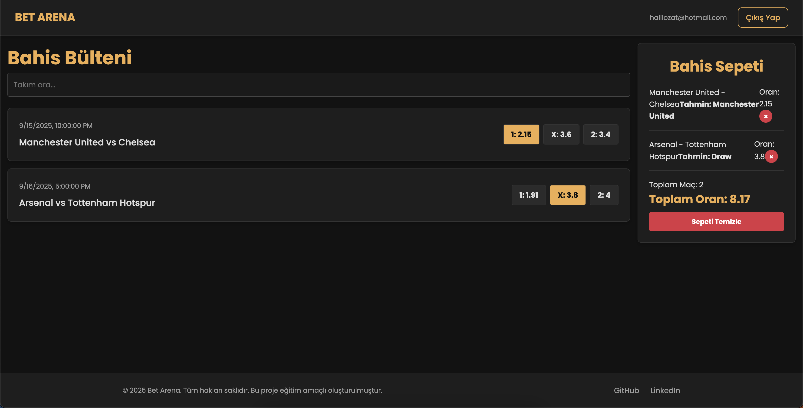

# Bet Arena - Modern Spor Bahisleri Web Uygulaması

Bu proje, React, Vite, TypeScript ve Redux Toolkit kullanılarak geliştirilmiş, modern ve interaktif bir spor bahisleri web uygulamasıdır. Kullanıcıların yaklaşan maçları ve oranlarını görüntülemesine, dinamik bir bahis kuponu oluşturmasına ve Firebase ile güvenli bir şekilde kimlik doğrulaması yapmasına olanak tanır.

**🔗 Canlı Demo:** [**sport-betting-web-gscejnjyj-halilozats-projects.vercel.app**]([https://sport-betting-web-gscejnjyj-halilozats-projects.vercel.app/login](https://sport-betting-web-app.vercel.app/login))



## 🚀 Özellikler

- **Dinamik Bahis Bülteni:** Maçların listelenmesi ve takım adına göre anlık arama/filtreleme.
- **İnteraktif Bahis Sepeti:**
    - Maçlara ait oranları kupona ekleme, çıkarma ve tek bir maç için oran güncelleme.
    - Sepetteki toplam maç sayısı ve toplam oranın anlık olarak hesaplanması.
    - Framer Motion ile akıcı ekleme/çıkarma animasyonları.
- **Firebase Authentication:**
    - E-posta ve şifre ile güvenli kullanıcı kaydı ve girişi.
    - Oturum kalıcılığı sayesinde sayfa yenilendiğinde oturumun korunması.
- **Profesyonel Rota Koruma (Route Guarding):**
    - Giriş yapmış kullanıcıların `login/register` sayfalarına erişiminin engellenmesi.
    - Giriş yapmamış kullanıcıların bülten gibi özel sayfalara erişiminin engellenmesi.
- **Firebase Analytics:** Temel kullanıcı etkileşimlerinin (sepete ekleme/çıkarma) takibi.
- **Modern ve Duyarlı Tasarım:** SCSS ve BEM metodolojisi ile oluşturulmuş, tüm cihazlarla uyumlu tasarım.

## 🛠️ Kullanılan Teknolojiler ve Kütüphaneler

- **Frontend:** React, Vite, TypeScript
- **State Management:** Redux Toolkit
- **Routing:** React Router DOM
- **Animasyon:** Framer Motion
- **Styling:** SCSS (Sass Module System ile)
- **API İstekleri:** Axios
- **Backend & Authentication:** Firebase (Auth, Analytics)
- **Kod Kalitesi:** ESLint, Prettier

## ⚙️ Kurulum ve Çalıştırma

Projeyi yerel makinenizde çalıştırmak için aşağıdaki adımları izleyin:

1.  **Depoyu Klonlayın:**
    ```bash
    git clone [https://github.com/KULLANICI_ADINIZ/REPO_ADINIZ.git](https://github.com/KULLANICI_ADINIZ/REPO_ADINIZ.git)
    cd REPO_ADINIZ
    ```

2.  **Bağımlılıkları Yükleyin:**
    ```bash
    npm install
    ```

3.  **Environment Değişkenlerini Ayarlayın:**
    Projenin ana dizininde `.env` adında bir dosya oluşturun ve kendi Firebase proje bilgilerinizi girin:
    ```
    # FIREBASE CONFIG
    VITE_FIREBASE_API_KEY="..."
    VITE_FIREBASE_AUTH_DOMAIN="..."
    VITE_FIREBASE_PROJECT_ID="..."
    VITE_FIREBASE_STORAGE_BUCKET="..."
    VITE_FIREBASE_MESSAGING_SENDER_ID="..."
    VITE_FIREBASE_APP_ID="..."
    VITE_FIREBASE_MEASUREMENT_ID="..."
    ```

4.  **Geliştirme Sunucusunu Başlatın:**
    ```bash
    npm run dev
    ```
    Uygulama şimdi `http://localhost:5173` adresinde çalışıyor olacaktır.
